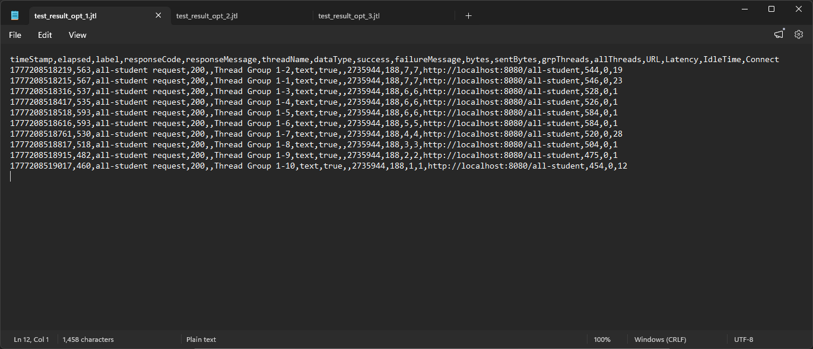
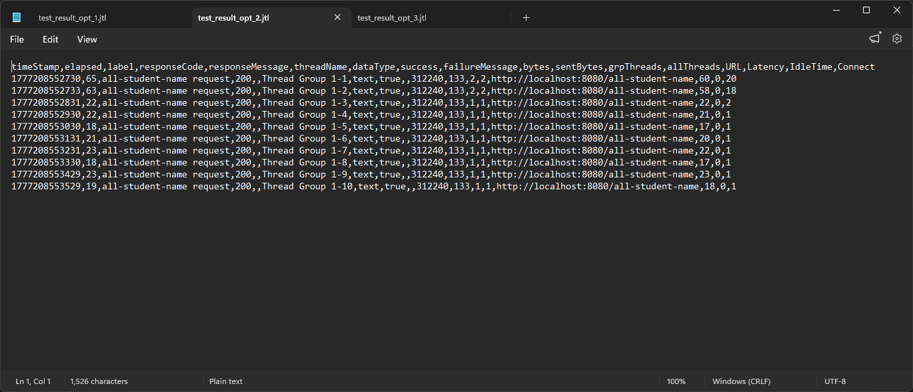
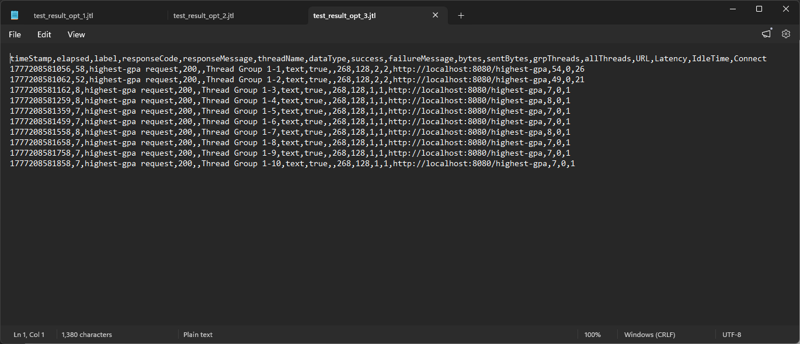

# Module 7: Profiling

## Test 1: `/all-student` endpoint

 Request of test 1

|                                                                               |                                                                                  |
| ----------------------------------------------------------------------------- | -------------------------------------------------------------------------------- |
| .png>) Sampler 1 | .png>) Sampler 2    |
| .png>) Sampler 3 | .png>) Sampler 4    |
| .png>) Sampler 5 | .png>) Sampler 6    |
| .png>) Sampler 7 | .png>) Sampler 8    |
| .png>) Sampler 9 | .png>) Sampler 10 |

 Summary result of test 1

 Graph result of test 1

 CLI result of test 1
JTL file of test 1: [test1.jtl](profiling-test/test_result_1.jtl)

**Refactoring changes**: The changes is in querying the database. Instead of doing N+1 queries to get the students and their courses, we can use `JOIN` to get all the data in one query. This will reduce the number of queries and improve the performance of the endpoint.

 CLI result of test 1 after optimization. Note the latency reduction from about 150000ms to about 500ms (about 99% increased performance).
JTL file of test 1 run after optimization: [test1.jtl](profiling-test/test_result_opt_1.jtl)

## Test 2: `/all-student-name` endpoint

 Request of test 2

|                                                                               |                                                                                  |
| ----------------------------------------------------------------------------- | -------------------------------------------------------------------------------- |
| .png>) Sampler 1 | .png>) Sampler 2    |
| .png>) Sampler 3 | .png>) Sampler 4    |
| .png>) Sampler 5 | .png>) Sampler 6    |
| .png>) Sampler 7 | .png>) Sampler 8    |
| .png>) Sampler 9 | .png>) Sampler 10 |

 Summary result of test 2

 Graph result of test 2

 CLI result of test 2
JTL file of test 2: [test2.jtl](profiling-test/test_result_2.jtl)

**Refactoring changes**: The changes focus on reducing string-processing and data-loading overhead. Instead of concatenating immutable strings in a loop and loading full `Student` entities, the service now fetches only student names and combines them using `String.join(", ", names)`. This reduces memory churn and improves response time for the endpoint.

 CLI result of test 2 after optimization. Note the latency reduction from about 3000ms to about 60ms (about 98% increased performance).
JTL file of test 2 run after optimization: [test2.jtl](profiling-test/test_result_opt_2.jtl)

## Test 3: `/highest-gpa` endpoint

 Request of test 3

|                                                                               |                                                                                  |
| ----------------------------------------------------------------------------- | -------------------------------------------------------------------------------- |
| .png>) Sampler 1 | .png>) Sampler 2    |
| .png>) Sampler 3 | .png>) Sampler 4    |
| .png>) Sampler 5 | .png>) Sampler 6    |
| .png>) Sampler 7 | .png>) Sampler 8    |
| .png>) Sampler 9 | .png>) Sampler 10 |

 Summary result of test 3

 Graph result of test 3

 CLI result of test 3
JTL file of test 3: [test3.jtl](profiling-test/test_result_3.jtl)

**Refactoring changes**: The changes move highest GPA selection from in-memory iteration to the database query layer. Instead of loading all students and scanning in Java, the service now requests only the top record ordered by GPA (`findFirstByOrderByGpaDescIdAsc`). This reduces data transfer and processing time for the endpoint.

 CLI result of test 3 after optimization. Note the latency reduction from about 150ms to about 55ms (about 63% increased performance).
JTL file of test 3 run after optimization: [test3.jtl](profiling-test/test_result_opt_3.jtl)

## Reflection

1. What is the difference between the approach of performance testing with JMeter and  profiling with IntelliJ Profiler in the context of optimizing application performance?

Think JMeter as a specialized version of Postman that focuses on load testing and performance testing. It simulates multiple users and measures how the application performs under different levels of load. JMeter helps identify bottlenecks and performance issues by generating reports and graphs based on the test results. The way it works in this module is by hitting a certain endpoint with a specified number of threads (users) and iterations, and then it collects data on response times, throughput, and other performance metrics.

Meanwhile, IntelliJ Profiler runs alongside with the backend application and provides insights into the application's performance at a more granular level. It allows us to analyze CPU usage, memory usage, thread activity, and other aspects of the application's behavior. The profiler helps identify specific methods or lines of code that are consuming excessive resources or causing performance issues. It provides a visual representation of the application's performance, making it easier to pinpoint areas that need optimization.

In other words, performance testing with JMeter focuses on measuring the overall performance of the application under load, while profiling with IntelliJ Profiler focuses on analyzing the internal workings of the application to identify specific performance bottlenecks and areas for optimization. Both approaches are complementary and can be used together to achieve optimal performance improvements in an application.

2. How does the profiling process help you in identifying and understanding the weak points in your application?

Profiling helps identify weak points in an application by providing detailed insights into how the application is executing. It allows us to see which methods or lines of code are consuming the most resources, such as CPU time or memory. By analyzing the profiling data, we can identify bottlenecks, inefficient algorithms, or areas of code that are causing performance issues.

3. Do you think IntelliJ Profiler is effective in assisting you to analyze and identify bottlenecks in your application code?

Yes, I found IntelliJ Profiler to be effective in assisting me to analyze and identify bottlenecks in my application code. It provides a user-friendly interface that allows me to easily navigate through the profiling data and identify areas of concern. The visual representation of the profiling data in the flame chart helps me quickly understand which parts of the code are causing performance issues, allowing me to focus my optimization efforts on those specific areas. Additionally, the ability to drill down into specific methods or lines of code provides valuable insights into the root causes of performance problems, making it easier to implement targeted optimizations. Overall, IntelliJ Profiler has been a valuable tool in helping me improve the performance of my application.

4. What are the main challenges you face when conducting performance testing and profiling, and how do you overcome these challenges?

The challenge I face when conducting performance testing and profiling is that the results from profiling with IntelliJ Profiler may not always be entirely consistent with findings from performance testing using JMeter. This can be due to various factors such as differences in the testing environment, variations in workload, or even the way the application behaves under different conditions. To overcome this challenge, I try to ensure that the testing environment is as consistent as possible when conducting both performance testing and profiling. I also try to run multiple iterations of both tests to gather more data and identify any patterns or trends that may emerge. Additionally, I analyze the results from both tests together to get a more comprehensive understanding of the application's performance and identify any discrepancies that may arise.

5. What are the main benefits you gain from using IntelliJ Profiler for profiling your application code?

The main benefits I gain from using IntelliJ Profiler for profiling my application code is that it provides detailed insights into the performance of my application at a granular level. It allows me to identify specific methods or lines of code that are consuming excessive resources or causing performance issues. The visual representation of the profiling data in the flame chart helps me quickly understand which parts of the code are causing performance issues, allowing me to focus my optimization efforts on those specific areas. Additionally, the ability to drill down into specific methods or lines of code provides valuable insights into the root causes of performance problems, making it easier to implement targeted optimizations. Overall, IntelliJ Profiler has been a valuable tool in helping me improve the performance of my application.

6. How do you handle situations where the results from profiling with IntelliJ Profiler are not entirely consistent with findings from performance testing using JMeter?

I handled it by ensuring that the testing environment is as consistent as possible when conducting both performance testing and profiling. I also ran multiple iterations of both tests to gather more data and identify any patterns or trends that may emerge. Additionally, I analyzed the results from both tests together to get a more comprehensive understanding of the application's performance and identify any discrepancies that may arise. If there are inconsistencies, I try to investigate further to understand the root causes and determine if there are any external factors that may be influencing the results.

7. What strategies do you implement in optimizing application code after analyzing results from performance testing and profiling? How do you ensure the changes you make do not affect the application's functionality?

The optimization strategies I used in this module are minimizing database queries and loops, by condensing multiple queries into a single query and reducing string concatenation overhead. This reduces database transfer and access which takes a significant amount of time and processing resources, and also reduces memory churn from creating multiple string objects. The improvement is significant, with latency reductions of about 99% for the `/all-student` endpoint and about 98% for the `/all-student-name` endpoint.
