# Module 7: Profiling

## Test 1: `/all-student` endpoint

### JMeter tests

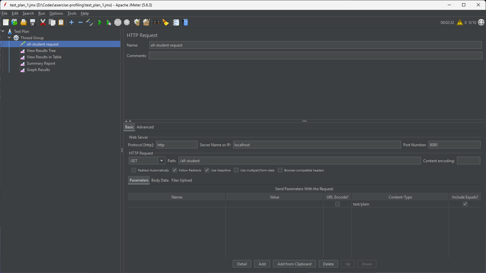 Request of test 1

|                                                                               |                                                                                  |
| ----------------------------------------------------------------------------- | -------------------------------------------------------------------------------- |
| .png>) Sampler 1 | .png>) Sampler 2    |
| .png>) Sampler 3 | .png>) Sampler 4    |
| .png>) Sampler 5 | .png>) Sampler 6    |
| .png>) Sampler 7 | .png>) Sampler 8    |
| .png>) Sampler 9 | .png>) Sampler 10 |

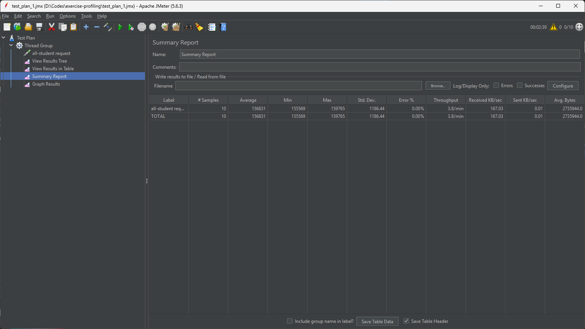 Summary result of test 1

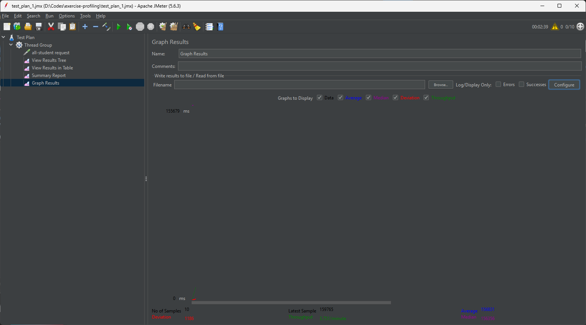 Graph result of test 1

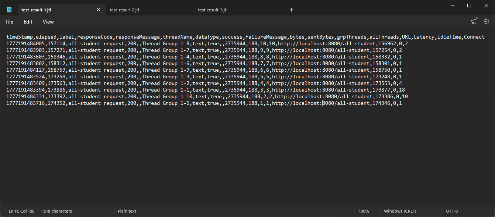 CLI result of test 1
JTL file of test 1: [test1.jtl](profiling-test/test_result_1.jtl)

### IntelliJ Profiler

Before
| Flame graph | Timeline |
| --- | --- |
| 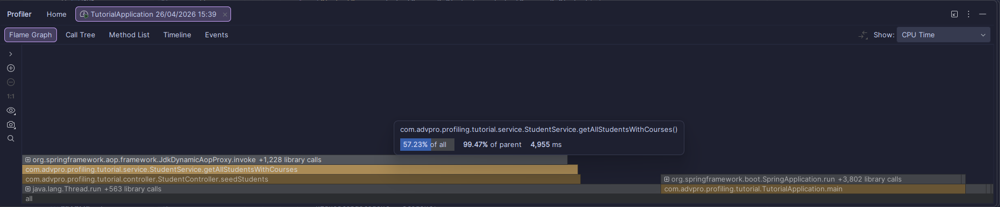 Flame graph of test 1 before refactoring | 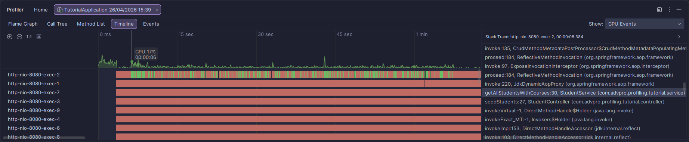 Timeline of test 1 before refactoring |

After
| Flame graph | Timeline |
| --- | --- |
| 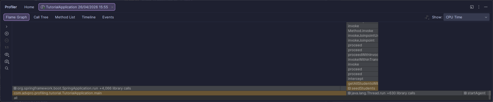 Flame graph of test 1 after refactoring | 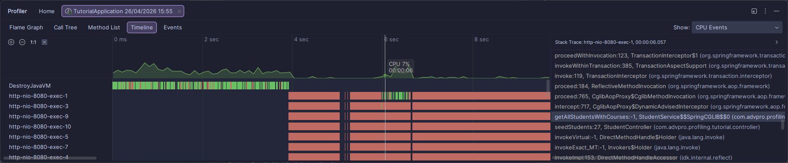 Timeline of test 1 after refactoring |

**Refactoring changes**: The changes is in querying the database. Instead of doing N+1 queries to get the students and their courses, we can use `JOIN` to get all the data in one query. This will reduce the number of queries and improve the performance of the endpoint.

## Test 2: `/all-student-name` endpoint

 Request of test 2

|                                                                               |                                                                                  |
| ----------------------------------------------------------------------------- | -------------------------------------------------------------------------------- |
| .png>) Sampler 1 | .png>) Sampler 2    |
| .png>) Sampler 3 | .png>) Sampler 4    |
| .png>) Sampler 5 | .png>) Sampler 6    |
| .png>) Sampler 7 | .png>) Sampler 8    |
| .png>) Sampler 9 | .png>) Sampler 10 |

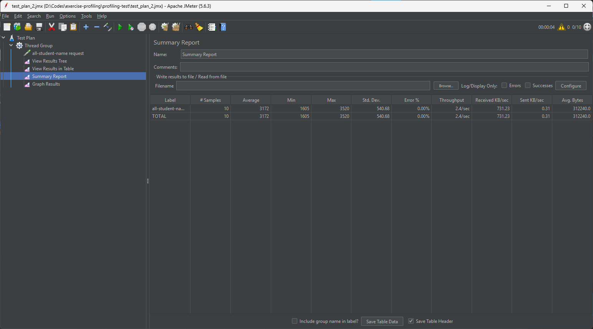 Summary result of test 2

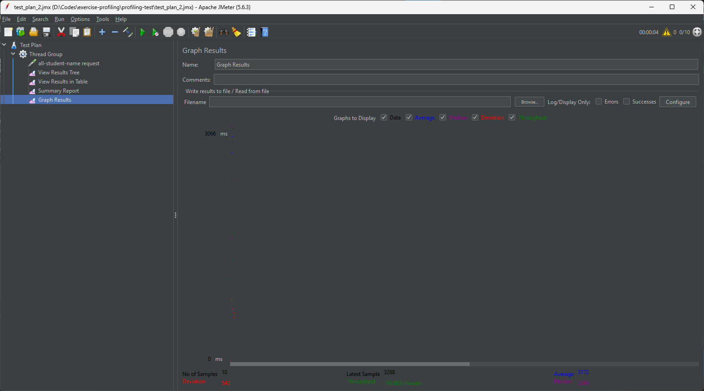 Graph result of test 2

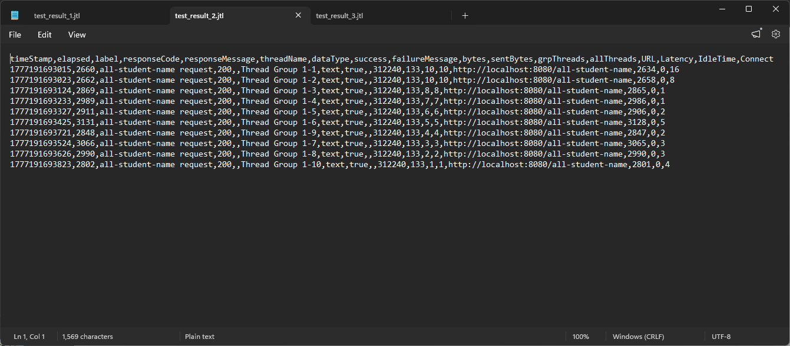 CLI result of test 2
JTL file of test 2: [test2.jtl](profiling-test/test_result_2.jtl)

## Test 3: `/highest-gpa` endpoint

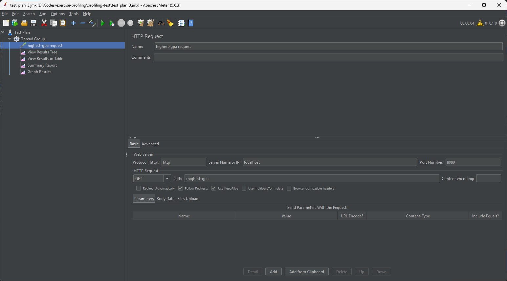 Request of test 3

|                                                                               |                                                                                  |
| ----------------------------------------------------------------------------- | -------------------------------------------------------------------------------- |
| .png>) Sampler 1 | .png>) Sampler 2    |
| .png>) Sampler 3 | .png>) Sampler 4    |
| .png>) Sampler 5 | .png>) Sampler 6    |
| .png>) Sampler 7 | .png>) Sampler 8    |
| .png>) Sampler 9 | .png>) Sampler 10 |

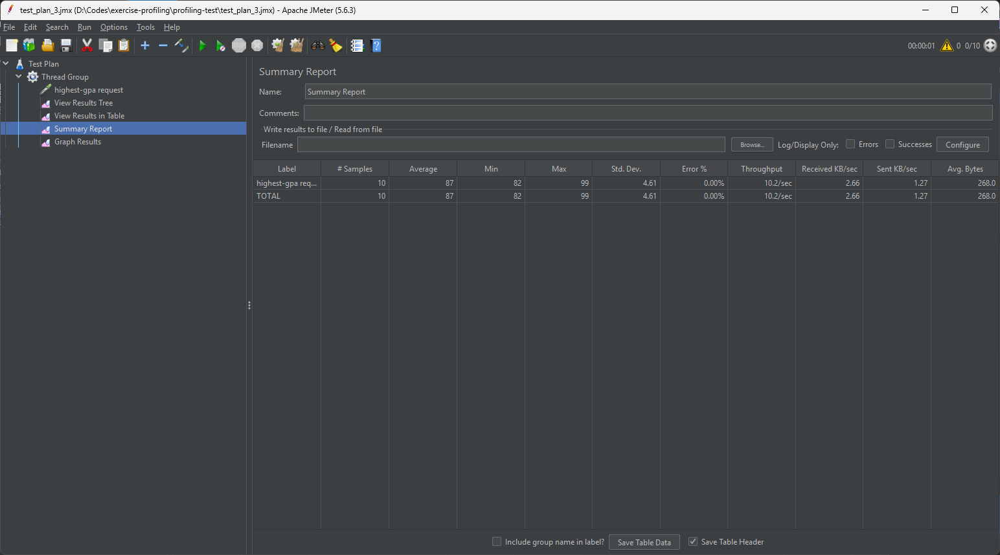 Summary result of test 3

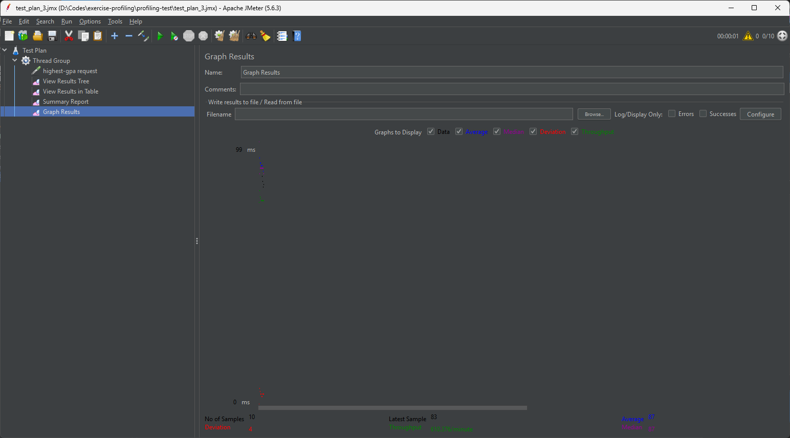 Graph result of test 3

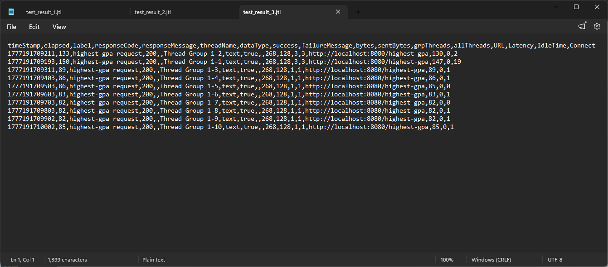 CLI result of test 3
JTL file of test 3: [test3.jtl](profiling-test/test_result_3.jtl)